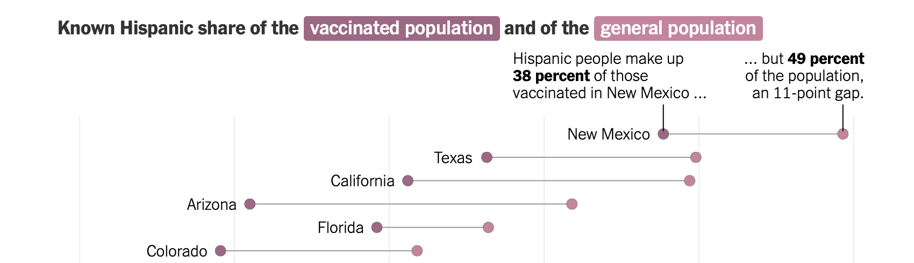
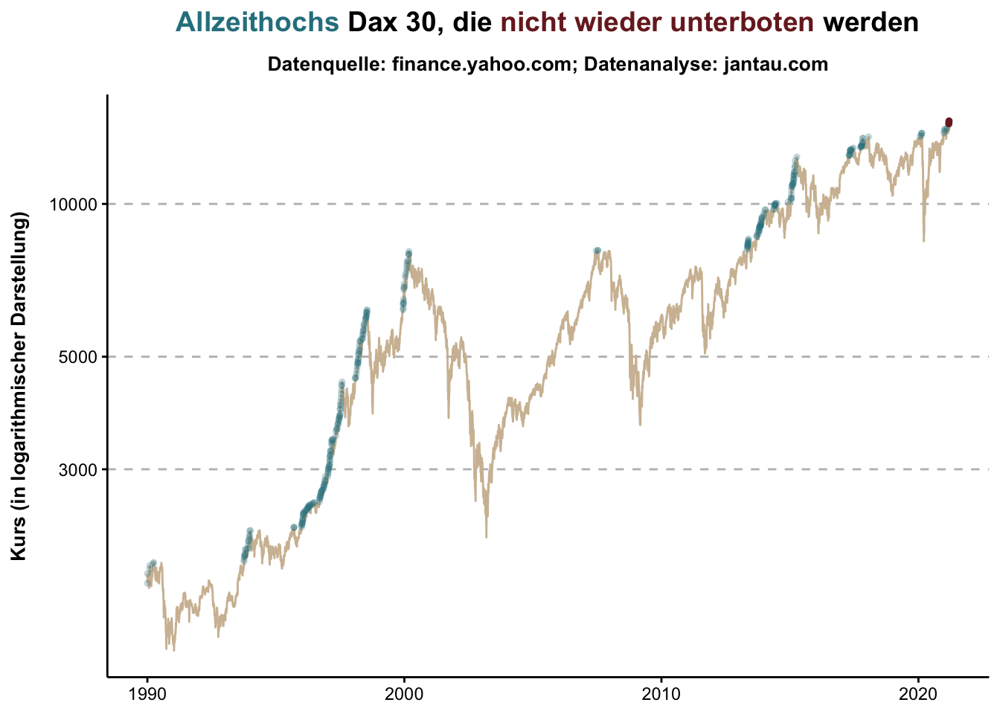
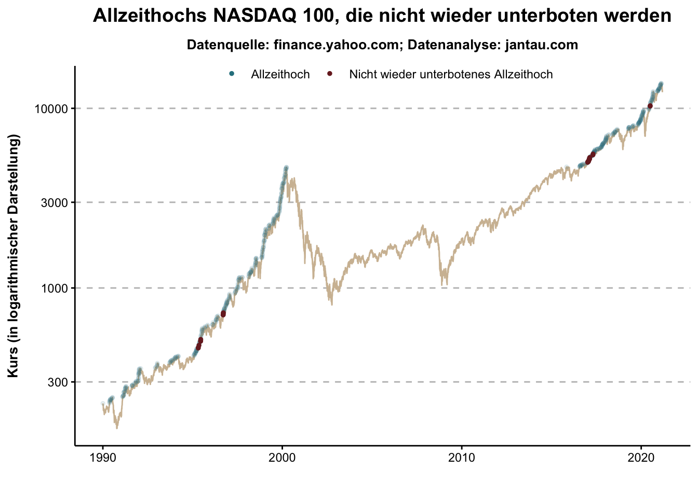

```{r include=FALSE}
knitr::opts_chunk$set(
	message = FALSE,
	warning = FALSE
)

library(readxl)
library(tidyverse)
library(scales)
library(xts)
library(lubridate)
library(stringr)
library(gameofthrones) # farbpaletten
library(DT)
library(gt)
library(tidyquant)
library(directlabels)
```

**In diesem Post werden Tipps und Tricks gesammelt, die mir das Arbeiten mit R erleichtern und es mir erlauben, Datentransformationen, Analysen und Visualisierungen nach meinen Vorstellungen durchzuführen.**

## Dezimalseparatoren und Tausendertrennzeichen ändern

Im Deutschen wird ein Komma als Dezimalseparator (z.B. 3,4 %) und ein Punkt als Tausendertrennzeichen (z.B. 10.000 €) oder ein schmales Leerzeichen (z.B. 10 000) verwendet. Im Englischen sind die Separatoren vertauscht. Ein Komma wird als Tausendertrennzeichen verwendet und ein Punkt als Dezimalseparator.

Um den [Dezimalseparator zu ändern](https://www.tutorialspoint.com/how-to-set-comma-as-decimal-separator-in-r), kann die Code Option `options(OutDec=",")` verwendet werden.

Eine wirklich einfache und globale Lösung für das Ändern der [Tausendertrennzeichen](https://de.wikipedia.org/wiki/Zifferngruppierung) habe ich nicht gefunden. Ich bin mir auch nicht sicher, ob es wirklich sinnvoll ist, da es den Datenaustausch erschwert.

Für einzelne Plots oder Tabelle kann es jedoch sinnvoll sein, ein Tausendertrennzeichen zu nutzen, da es die Lesbarkeit erhöht. Auf Stackoverflow habe ich einen Post gefunden, der beschreibt, wie die [Tausendertrennzeichen verändert](https://stackoverflow.com/questions/48880982/r-set-dot-as-thousands-separator-and-comma-as-decimal-separator) werden können. Zusätzlich zeigt das Beispiel auch noch, wie Euro- oder Prozentzeichen angezeigt werden können.

```{r}
set.seed(42)  ## for sake of reproducibility
n <- 10
dat <- data.frame(
  years = 1:n,
  group = rep(LETTERS[1:10]),
  money = sample(30000:50000, n, replace = TRUE)
)


ggplot(dat, aes(x = group,
                y = money,)) +
  geom_point() +
  theme_classic() +
  scale_y_continuous(labels = dollar_format(
    big.mark = " ",
    decimal.mark = ",",
    suffix = " €",
    prefix = ""
  )) 
```

## Reproduzierbaren Code erstellen

Dieser Post zeigt, wie [reproduzierbarer Code erzeugt werden](https://stackoverflow.com/questions/5963269/how-to-make-a-great-r-reproducible-example) kann, um Fragen auf Stack Overflow zu stellen.

## Pretty Code

Das Addin `Reformat Code` kann verwendet werden, um Code besser lesbar darzustellen. Einfach den Code markieren und `Code >> Reformat Code` auswählen. Das Addin `formatR` soll jedoch [noch besser sein](https://stackoverflow.com/questions/15703553/auto-format-r-code-in-rstudio/34856235). Das habe ich allerdings noch nicht getestet.

## Plots auf Mobilgeräten in voller Größe anzeigen

Auf kleinen Bildschirmen werden Plots sehr klein angezeigt, da sie auf die Breite des Bildschirms schrumpfen und der Inhalt des Plots nicht der verringerten Größe angepasst wird. Es gibt jedoch [die Möglichkeit, durch CSS-Elemente](https://stackoverflow.com/questions/52448104/how-to-add-horizontal-scroll-bar-for-a-ggplot-plot-in-rmarkdown-html) die Größe der Plots beizubehalten und sie durch ein seitwärts Scrollen zu betrachten.

```{r eval=FALSE}
<style >
  .superbigimage{
    overflow - x:scroll
    white - space:nowrap
  }

.superbigimage img{
  max - width:none
}

</style>
  
  
This produces the plot with a special css class
<div class = "superbigimage">
/ ```{
    r plot_it , echo = FALSE, fig.width = 20, fig.height = 3
  }
plot1
/ ```
</div> 
```

Ich bin mir jedoch nicht sicher, ob es wirklich nutzerfreundlicher ist, die Plots in voller Größe zu zeigen. 

## Plots speichern, Pixel-Dimension festlegen, Hintergrund transparent gestalten, Favicon ändern

Ich wollte das Favicon (das kleine von Webbrowsern verwendet Symbol oder Logo) ändern. Da ich für den Blog noch kein Logo hatte, wollte ich einen charakteristischen Plot aus einem meiner Blog-Posts anpassen, in den richtigen Dimensionen speichern, mit einem transparenten Hintergrund versehen und als Favicon hochladen. Hier ist mein Vorgehen:

### Plot anpassen und speichern

Zunächst habe ich einen bereits verwendeten Plot reproduziert. In diesem Fall einen Plot, der die Performance in Prozent der Indizes Dax, MSCI World und NASDAQ 100 von 2016 bis 2020 abbildet. Um den Plot jedoch als kleines Icon speichern zu können, habe ich die Plot-Titel, Plot-Achsen, Plot-Legenden usw mit `theme_void()` und mit `theme(legend.position="none")` entfernt.
```{r}
# Daten von yahoo.finance.com einlesen
indexvgl <- tq_get(c("EXXT.DE","DBXD.DE","XDWD.DE"),
                      get  = "stock.prices",
                      from = "2016-01-01",
                      to = "2020-12-31")

# Monatliche Performance in Prozent berechnen
indexvgl_monthly <- indexvgl %>% group_by(symbol) %>% 
  tq_transmute(select     = adjusted, 
               mutate_fun = periodReturn,
               period     = "monthly")%>% 
  ungroup()

# Kummulierte Performance berechnen
indexvgl_monthly <- indexvgl_monthly %>% group_by(symbol) %>%
  mutate(cumsum = cumsum(monthly.returns)*100)

# Farbpalette festlegen
pal <- got(3, option = "Daenerys", direction = -1)

# Level der Indizes festlegen
indexvgl_monthly$symbol <-
  factor(indexvgl_monthly$symbol,
         levels = c("EXXT.DE", "XDWD.DE", "DBXD.DE"))

# Plot erstellen
  ggplot(data = indexvgl_monthly, aes(x = date, y = cumsum, color = symbol)) +
  geom_line(size = 4) +
    theme_void() +
    theme(legend.position="none") +
    scale_color_manual(values = pal,
                     labels = c("Nasdaq 100", "MSCI World", "DAX 30"))
```

Anschließend habe ich den Plot mit der Funktion `ggsave()` gespeichert.

```{r}
  ggsave(
  "icon.png",
  plot = last_plot(),
  device = "png",
  path = NULL,
  scale = 1,
  width = 135.46666667,
  height = 135.46666667,
  units = "mm",
  dpi = 72,
  limitsize = TRUE)
```

### Pixel-Dimension festlegen, Hintergrund transparent gestalten

Es war jedoch nicht möglich, die Pixel-Dimension von 512*512, [die von Wowchemy vorgegeben wird](https://wowchemy.com/docs/getting-started/customization/) direkt mit `ggsave()` zu speichern. Aus diesem Grund habe ich ImageMagick über Brew heruntergeladen. Über die Kommandozeile konnte ich so mit den Befehlen `convert icon.png -resize 512x512 thumbnail.png` und `magick convert thumbnail.png -transparent "#ffffff" transparent.png` die Pixel-Dimension anpassen und den Hintergrund transparent machen.

### Favicon ändern

Das Icon musste im letzten Schritt als `icon.png` gespeichert werden und in den Ordner `jantau/assets/images` abgelegt werden.

## Shiny App Test

Ich habe zwei Möglichkeiten gefunden, mit Shiny erstellte Apps in Blog-Posts zu integrieren.

Der erste ist in Yihui Xies [bookdown: Authoring Books and Technical Documents with R Markdown](https://bookdown.org/yihui/bookdown/web-pages-and-shiny-apps.html){target="_blank"} beschrieben. Hier wird die `knitr`-Funktion `ìnclude_app` empfohlen. Die Intergration meiner ersten Shiny-App erfolgt dann so:

```{r eval=FALSE, include=TRUE}
knitr::include_app("https://jantau.shinyapps.io/ter_surcharge/", height = "700px")
```

Antoine Soetewey von Stats und R [empfiehlt ein `iframe`-Element zu nutzen](https://statsandr.com/blog/how-to-embed-a-shiny-app-in-blogdown/){target="_blank"}:

```{r eval=FALSE, include=TRUE}
<iframe height="1000" width="100%" frameborder="no" src="https://jantau.shinyapps.io/ter_surcharge/"> </iframe>
```

Nach einigen Versuchen hat sich die Integration der Shiny-URL in ein `iframe`-Element als überlegen erwiesen. Es wird erstens kein störender Rand um die Shiny-App gebildet und zweitens ist die Darstellung auf Mobilgeräten wesentlich besser, da die App an die Breite des Bildschirms angepasst wird und ein seitliches Scrollen bei dem Plot und dem Sidebar-Panel nicht nötig ist.

<iframe height="1200" width="100%" frameborder="no" src="https://jantau.shinyapps.io/ter_surcharge/"> </iframe>

## Legende in Plot-Titel integrieren

Die Beschriftung von Grafiken ist nicht die Stärke von ggplot. Es ist umständlich, Erläuterungen in der richtigen Formatierung an die richtige Stelle zu setzen. Es kann leicht geschehen, dass die Beschriftung überdeckt oder abgeschnitten wird. Dabei wird meines Erachtens eine effektive und grafisch anspruchsvolle Beschriftung von Plots immer wichtiger. In einem [Chart aus der New York Times](https://www.nytimes.com/interactive/2021/03/29/us/hispanic-vaccine-gap.html?action=click&module=Top%20Stories&pgtype=Homepage) wurde beispielsweise die Legende in den Titel integriert. 



Für Legenden mit wenigen Leveln halte ich das für einen eleganten Weg, um wichtige Informationen übersichtlich und ohne unnötige Redundanzen in der Grafik unterzubringen. 

Nach einigem Suchen habe ich auch einen Weg gefunden, der dies ziemlich gut ermöglicht. Mit dem [`ggtext`-Package](https://wilkelab.org/ggtext/articles/introduction.html) können die Beschriftungen von Plots mit Markdown- und HTML-Auszeichnungen versehen werden.

Über das Element `theme(plot.title = element_markdown())`wird definiert, dass der Plot-Titel mit `ggtext` erstellt wird. Im Plot-Titel kann dann mit HTML `<span style='color:#2B818EFF;'>Allzeithochs</span>` die Farbe einzelner Wörter gezielt geändert werden. (Leider muss ein Hex-Farbcode angegeben werden, da sich nicht wie im Plot eine zuvor definierte Variable einsetzen lässt.) 

```{r eval=FALSE, include=TRUE}
library(ggtext)

pal <- got(3, option = "Daenerys", direction = -1)

ggplot(dax, aes(x = date, y = adjusted)) +
  geom_line(color = pal[1]) +
  geom_point(
    data = dax %>% filter(ath == 1),
    aes (x = date, y = adjusted),
    color = pal[2],
    size = 1,
    alpha = .2
  ) +
  geom_point(
    data = dax %>% filter(last_low == 1 & ath == 1),
    aes (x = date, y = adjusted),
    color = pal[3],
    size = 1,
    alpha = 1
  ) +
  scale_y_log10() +
  theme_jantau +
  theme(
    panel.grid.major.y = element_line(colour = "grey", linetype = "dashed"),
    plot.title = element_markdown()
  ) +
  labs(
    title = "<span style='color:#2B818EFF;'>Allzeithochs</span> Dax 30, die <span style='color:#792427FF;'>nicht wieder unterboten</span> werden",
    x = "",
    y = "Kurs (in logarithmischer Darstellung)",
    color = "",
    fill = "",
    subtitle = "Datenquelle: finance.yahoo.com; Datenanalyse: jantau.com"
  )
```



Die Alternative hierzu ist, eine herkömmliche Legende zu erstellen.



Mir gefällt die erste Variante besser, da die Begriffe "Allzeithoch" und "nicht wieder unterboten" aus dem Titel nicht noch einmal in der Legende wiederholt werden müssen.

Den für diesen Beitrag erstellten Code findest du hier: [https://github.com/jantau/jantau](https://github.com/jantau/jantau/tree/main/content/post){target="_blank"}