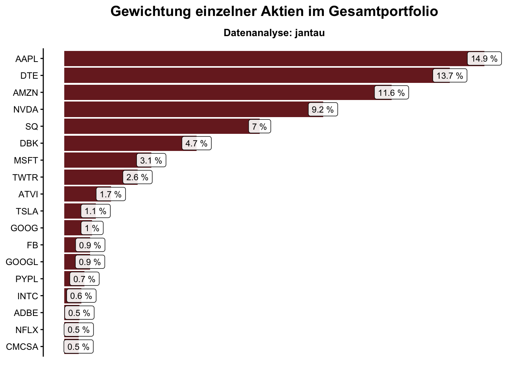
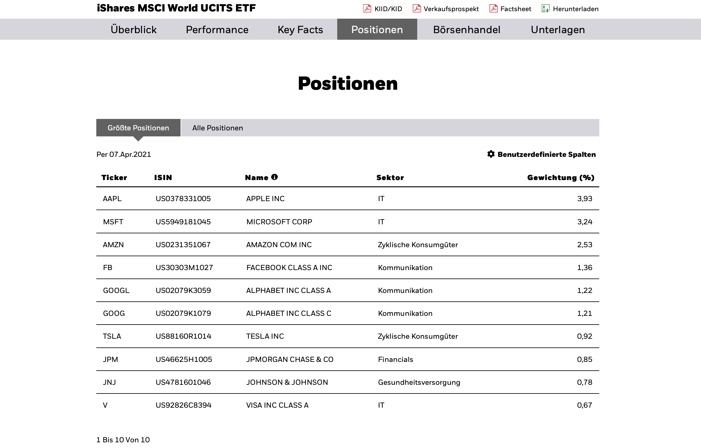

```{r setup, include=FALSE}
knitr::opts_chunk$set(
	echo = FALSE,
	message = FALSE,
	warning = FALSE,
	collapse = TRUE,
	options(scipen = 999)
)

cat("\014") # Clear your console
rm(list = ls()) # Clear your environment

# Load in header file
source("/Users/jan/blog/jantau/content/post/header.R")
```


```{r}
NASDAQ_100 <- read_excel("~/blog/Constituents_Weights_Indices.xlsx", 
    sheet = "NASDAQ_04_2021", col_names = FALSE)

MSCI_World <- read_excel("~/blog/Constituents_Weights_Indices.xlsx", 
    sheet = "MSCI_World_04_2021", col_names = FALSE)

MSCI_Info <- read_excel("~/blog/Constituents_Weights_Indices.xlsx", 
    sheet = "MSCI_Info_04_2021", col_names = FALSE)

colnames(NASDAQ_100) <- c("Ticker", "Name", "Gewichtung", "Sektor", "ISIN")

NASDAQ_100 <- NASDAQ_100 %>%
  mutate(Gewichtung = Gewichtung / 100) %>%
  mutate(Gewichtung_Nasdaq_100 = Gewichtung * 0.2195) %>%
  select(1, 4, 5, 6)

colnames(MSCI_World) <- c("Ticker", "Name", "Gewichtung", "Sektor", "ISIN")

MSCI_World <- MSCI_World %>%
  mutate(Gewichtung = Gewichtung / 100) %>%
  mutate(Gewichtung_MSCI_World = Gewichtung * 0.1654) %>%
  select(1, 4, 5, 6)

colnames(MSCI_Info) <- c("Ticker", "Name", "Gewichtung", "Sektor", "ISIN")

MSCI_Info <- MSCI_Info %>%
  mutate(Gewichtung = Gewichtung / 100) %>%
  mutate(Gewichtung_MSCI_Info = Gewichtung * 0.0352) %>%
  select(1, 4, 5, 6)

ISIN <- c("DE0005557508", "US0378331005", "US0231351067", "US67066G1040", "US8522341036", "DE0005140008", "US90184L1026", "US00507V1098")
Ticker <- c("DTE", "AAPL", "AMZN", "NVDA", "SQ", "DBK", "TWTR", "ATVI")
Gewichtung_Single_Stocks <- c(0.137, 0.112, 0.094, 0.084, 0.069, 0.047, 0.0259, 0.015)

Single_Stocks <- data.frame(Ticker, ISIN, Gewichtung_Single_Stocks)

weight_all <- plyr::join_all(list(NASDAQ_100, MSCI_World, MSCI_Info, Single_Stocks), by = "ISIN", type = "full")
```

```{r}
weight_all <- weight_all %>%
  replace(is.na(.), 0) %>%
  mutate(sum = rowSums(.[4:7])) %>%
  arrange(desc(sum)) %>%
  mutate(sum = sum * 100)
```

```{r}
weight_all_long_2 <- pivot_longer(weight_all, cols = starts_with("Gewichtung")) %>%
  mutate(value = value * 100)
```


```{r}
pal <- got(4, option = "Daenerys", direction = 1)

weight_all_long_3 <- weight_all_long_2 %>%
  filter(sum >= 0.5) %>%
  mutate(value = round(value, 2))

hc <- hchart(
  weight_all_long_3,
  'bar',
  hcaes(x = 'Ticker', y = 'value', group = 'name'),
  stacking = "normal"
  #, tooltip = list(pointFormat = "{series.name}: {point.value:.2f} %")
) %>%
  hc_title(text = "Gewichtung einzelner Aktien im Gesamtportfolio") %>%
  hc_caption(text = "Datenanalyse und Visualisierung: jantau.com") %>%
  hc_xAxis(title = list(text = NULL)) %>%
  hc_yAxis(
    title = list(text = "Anteil in Prozent am Gesamtportfolio"),
    labels = list(format = "{value} %")
  ) %>%
  hc_tooltip(valueSuffix = " %") 
#%>%
 # hc_colors(pal)

saveWidget(hc, file = "weight_stocks.html", selfcontained = TRUE)
```

```{r}
#<!--html_preserve-->
#<iframe height="500" width="100%" frameborder="no" src="hc.html"> </iframe>
#<!--/html_preserve-->

# frameWidget(hc) does not work

# htmlwidgets::saveWidget(hc, file = "hc.html", selfcontained = TRUE)
# <iframe seamless src="hc.html" width="100%" height="500"></iframe>

# height="500" width="100%" frameborder="no"
#  z-index:999999;
# style="position:fixed; top:0; left:0; bottom:0; right:0; width:100%; height:100%; border:none; margin:0; padding:0; overflow:hidden;"
```

```{r}
df <- weight_all_long_2 %>%
  group_by(Sektor, name) %>%
  summarise(value = sum(value)) %>%
  group_by(Sektor) %>%
  mutate(sum = sum(value)) %>%
  arrange(desc(sum)) %>%
  filter(sum > 0) %>%
  mutate(value = round(value, 2))
```

```{r}
df2 <- df %>%
  group_by(Sektor, sum) %>%
  distinct(Sektor)
```

```{r}
number_col <- length(unique(weight_all_long_2$name))

pal <- got(number_col, option = "Daenerys", direction = 1)

hc2 <- hchart(
  df,
  'bar',
  hcaes(x = 'Sektor', y = 'value', group = 'name'),
  stacking = "normal"
) %>%
  hc_title(text = "Gewichtung nach Sektoren im Gesamtportfolio") %>%
  hc_caption(text = "Datenanalyse und Visualisierung: jantau.com") %>%
  hc_xAxis(title = list(text = NULL)) %>%
  hc_yAxis(
    title = list(text = "Anteil in Prozent am Gesamtportfolio"),
    labels = list(format = "{value} %")
  ) %>%
  hc_tooltip(valueSuffix = " %") 
#%>%
#  hc_colors(pal)

saveWidget(hc2, file = "weight_sectors.html", selfcontained = TRUE)

```

```{r eval=FALSE}
# Pie chart 1
hc4 <- hchart(df2,
    "pie", innerSize = 300, hcaes(x = Sektor, y = sum))

hc4
```

```{r eval=FALSE}
# Pie chart 2

hc5 <- highchart() %>%
  hc_chart(type = "pie") %>% #type = "line", polar = TRUE 
  hc_xAxis(categories = df2$Sektor) %>%
  hc_series(
    list(
     name = "Gewichtung",
     data = df2$sum,
     colorByPoint = TRUE,
     type = "pie",
     size = "40%",
     showInLegend = FALSE
   ),
   list(
    name = "Gewichtung",
    data = df$value,
 #   pointPlacement = "on",
    type = "pie",
    size = "100%",
    innerSize = "50%",
    # color = "steelblue",
    showInLegend = FALSE
    )
   )

```

```{r eval=FALSE}
# Pie chart 3
highchart() %>% 
   hc_chart(type = "pie") %>%
   hc_add_series(labels = df$name, values = df$value, data = df$value, size = "45%", innerSize = "30%") %>% 
   hc_add_series(df2$sum, size = "100%", innerSize = "50%")


  hchart(df2, type = "pie", innerSize = 300, hcaes(Sektor, sum)) 
```


```{r eval=FALSE}
paises_2007 <- datos::paises %>% 
  filter(anio == max(anio)) %>% 
  mutate(poblacion = round(poblacion/1e6))

data_to_hierarchical_series <- function(data, group_vars, size_var) {
  
  # data <- paises_2007
  # group_vars <- c("continente", "pais")
  # size_var <- "poblacion"
  
  group_syms <- rlang::syms(group_vars)
  size_sym <- rlang::sym(size_var)
  
  if (data %>%
      select(!!!group_syms) %>%
      mutate_all(as.character) %>%
      purrr::map(unique) %>%
      unlist() %>%
      anyDuplicated()) stop("Sunburst data uses same label at multiple levels.")
  
  data <- data %>%
    mutate_at(vars(all_of(group_vars)), as.character)
  
  name_cell <- function(..., depth) paste0(list(...), 1:depth, collapse = "")
  
  data_at_depth <- function(depth = 1) {
    
    data %>%
      group_by(!!!group_syms[1:depth]) %>%
      summarise(value = sum(!!size_sym)) %>%
      ungroup() %>%
      arrange(desc(value)) %>% 
      mutate(name = !!group_syms[[depth]],
             level = depth) %>%
      # mutate_at(group_vars, as.character()) %>%
      {
        if (depth == 1)
          mutate(., id = paste0(name, 1))
        else {
          mutate(
            .,
            parent = purrr::pmap_chr(list(!!!group_syms[1:depth - 1]),
                                     name_cell,
                                     depth = depth - 1),
            id = paste0(parent, name, depth)
          )
        }
      }
  }
  
  sunburst_df <- 1:length(group_vars) %>%
    purrr::map(data_at_depth) %>%
    bind_rows() %>%
    arrange(level)
  
  data_list <- sunburst_df %>%
    highcharter::list_parse() # %>% purrr::map( ~ .[!is.na(.)])
  
  data_list
  
}


dataserie <- data_to_hierarchical_series(
  paises_2007,
  group_vars = c("continente", "pais"),
  size_var = "poblacion"
  )

dataserie <- data_to_hierarchical_series(
  df,
  group_vars = c("Sektor", "name"),
  size_var = "value"
  )

highchart() %>%
  hc_add_series(
    data = dataserie,
    type = "sunburst",
    # type=  "treemap",
    allowDrillToNode = TRUE,
    levels = list(
      list(
        level = 1,
        borderWidth = 0,
        borderColor = "transparent",
        colorByPoint = TRUE,
        dataLabels = list(enabled = T)
        ),
      list(
        level = 2,
        borderWidth = 0,
        borderColor = "transparent",
        colorVariation = list(key = "brightness", to = 0.50),
        dataLabels = list(enabled = T)
        )
      )
    )
```


Im Blogpost [Aktien-Gewichtung in meinem Portfolio](/post/portfolio-und-aktien/){target="_blank"} habe ich die Gewichtung einzelner Aktien in meinem ETF-und-Einzelaktien-Portfolio untersucht. Ich wollte wissen, welchen Anteil einzelne Aktien über alle Anlageprodukte hinweg im Portfolio einnehmen. Das Ergebnis überraschte mich nicht sonderlich, da ich eine ähnliche Gewichtung der größten Einzelpositionen wie Apple und Co erwartet hatte. 

Hier noch einmal das Ergebnis: 

<style >
.resize {
  height: auto;
  max-width:150%;
  max-height:150%;
  margin-left: -20px;
  margin-right: -20px;
}
</style >

<style >
.full-width {
	left: 50%;
	margin-left: -50vw;
	margin-right: -50vw;
	max-width: 100vw;
	position: relative;
	right: 50%;
	width: 100vw;
}
</style >

Nun habe ich mir die Analyse ein weiteres Mal vorgenommen, um einerseits die Visualisierung mit dem interaktiven JavaScript-Package `Highcharter` zu wiederholen und um andererseits die Gewichtung der Sektoren zu analysieren. Das Ergebnis der Sektorenanalyse hat mich dann schon einigermaßen überrascht und ich muss mir überlegen, ob ich nicht stärker nach Sektoren diversifizieren sollte.

## Visualisierung mit Highcharter

Die interaktive Visualisierung mit dem Package `Highcharter` ermöglicht es mir, eine weitere Variable sinnvoll in den Chart zu integrieren und somit tiefer in die Daten hineinzuzoomen. In dem ursprünglichen statischen Chart hatte ich die größten Aktien und ihren prozentualen Anteil am Gesamtportfolio abgebildet. Die zusätzliche hierarchische Variable enthält die ETFs, aus denen sich die einzelnen Aktienanteile speisen. So kann abgebildet werden, zu welchem Anteil sich beispielsweise die Apple-Anteile auf den Einzelaktienanteil, den NASDAQ-100-ETF oder den MSCI-World-ETF verteilen.

<iframe height="500" width="100%" frameborder="no" src="https://jantau.github.io/highchart/weight_stocks"> </iframe>

## Gewichtung nach Sektoren 

Der MSCI-World umfasst etwa 1600 einzelne Positionen, von denen viele nur im Promille-Bereich enthalten sind. Die große Anzahl an Positionen lässt sich weder in Tabellenform noch in einem Chart sinnvoll darstellen. Es muss somit eine zusammenfassende Kategorie genutzt werden, die mit der Sektorenklassifikation zur Verfügung steht. Etablierte Klassifikationen sind der [Global Industry Classification Standard (GICS)](https://www.msci.com/gics){target="_blank"} und der [Industry Classification Benchmark (ICB)](https://www.ftserussell.com/data/industry-classification-benchmark-icb){target="_blank"}.

Beide verfügen über vier Hierarchieebenen. Auf der obersten Ebene befinden sich die elf Sektoren Energy, Materials, Industrials, Consumer Discretionary, Consumer Staples, Health Care, Financials, Information Technology, Communication Services, Utilities und Real Estate. 

Die [iShares-Daten](https://www.ishares.com/de/privatanleger/de/produkte/253741/ishares-nasdaq-100-ucits-etf){target="_blank"} beinhalten auch die Sektoreninformationen (übersetzt in Energie, Materialien, Industrie, Zyklische Konsumgüter, Nichtzyklische Konsumgüter, Gesundheitsversorgung, Financials, IT, Kommunikation, Versorger und Immobilien) und können somit zur Analyse der Gewichtung nach Sektoren herangezogen werden.



Da jede Aktie nur einem der elf Sektoren auf der obersten Ebene zugeordnet wird, kann die Analyse nach Sektoren gut genutzt werden, um die vielen Einzelpositionen präzise in elf Sektoren zu aggregieren. So lässt sich die Diversifikation über Geschäftsfelder analysieren. 
(Der Nachteil einer solchen Zuordnung ist, dass Unternehmen mit sehr heterogenen Geschäftsaktivitäten eigentlich mehreren Sektoren zugeordnet werden müssten. Amazon ist beispielsweise dem Sektor zyklische Konsumgüter zugeordnet, was den Ursprüngen von Amazon als Online-Buchhändler geschuldet ist. Mit den Amazon Web Services (AWS), den Whole-Foods-Supermärkten oder dem Einstieg im Gesundheitsmarkt ist Amazon jedoch auch in anderen Sektoren wie IT, Nichtzyklische Konsumgüter oder Gesundheitsversorgung aktiv. Insofern wird die Klassifikation jedes Unternehmens mit einem einzelnen Sektor nicht immer den umfangreichen Geschäftsaktivitäten gerecht.)

<iframe height="500" width="100%" frameborder="no" src="https://jantau.github.io/highchart/weight_sectors"> </iframe>

Ich bin überrascht über die geringe Diversifikation über Sektoren. Dass IT und Kommunikation einen großen Anteil haben, war zu erwarten. Ich hatte jedoch nicht gedacht, dass die sieben Sektoren Gesundheitsversorgung, Nichtzyklische Konsumgüter, Industrie, Materialien, Versorger, Energie und Immobilien lediglich 10 % des Portfolios ausmachen. Im MSCI World umfassen diese Sektoren immerhin 43 % (was gut dargestellt wird, wenn man im Chart nur Gewichtung_MSCI_World auswählt). Ich muss mir daher überlegen, meine Anlagestrategie anzupassen, um diese Sektoren zu stärken.

### Anmerkungen:
<font size="3"> 
Ich habe keinen Weg gefunden, die `Highcharter`-JavaScript-Charts direkt in meinen `Blogdown`-Blog zu integrieren, denn [Netlify](https://www.netlify.com){target="_blank"} findet diese nicht beim Deployment. Nach einigem Hin und Her habe ich einen vertretbaren (wenn auch nicht besonders eleganten) Workaround gefunden. Ich speichere die `Highcharter`-Charts als HTML-Dokument und lade sie auf eine [eigens zu diesem Zweck erstellte Website](https://jantau.github.io/highchart/){target="_blank"}. Die URLs von dieser Website kann ich mittels `<iframe>`-Element auf meinem Blog veröffentlichen.
</font>

Den für diesen Beitrag erstellten Code findest du hier: [https://github.com/jantau/jantau](https://github.com/jantau/jantau/tree/main/content/post){target="_blank"}
