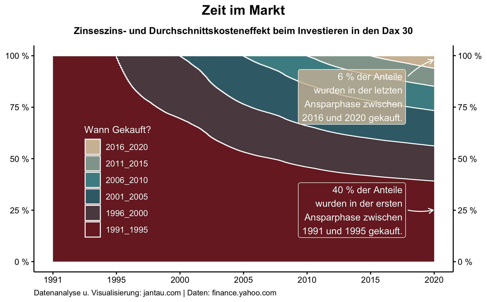
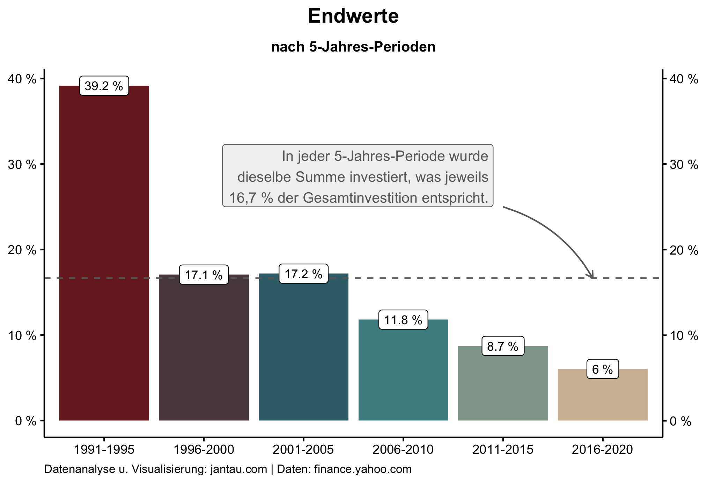
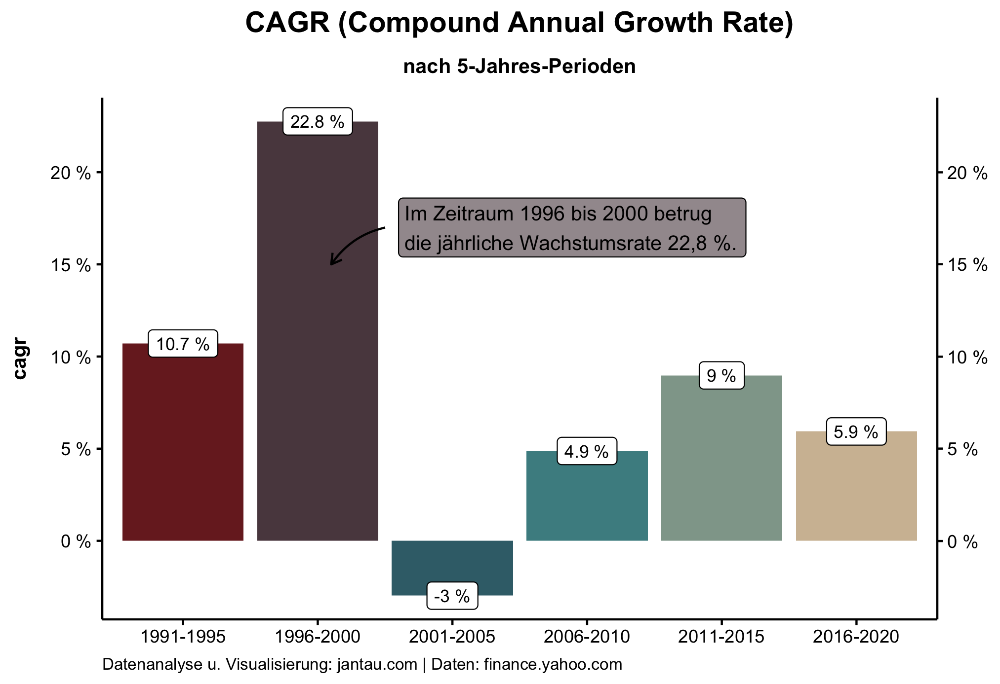

Eine Börsenweisheit lautet *time in the market beats timing the market*. Dieser Aussage liegt erstens die Annahme zugrunde, dass große Märkte über einen längeren Zeitraum eine steigende Tendenz haben und dass es zweitens ohne Insiderinformationen nicht möglich ist, verlässlich den besten Zeitpunkt zum Investieren zu finden.

Mit einem weiteren Backtest möchte ich diese Börsenweisheit analysieren. Ich habe einen Sparplan für den Dax 30 simuliert, in dem kontinuierlich über einen Zeitraum von 30 Jahren (1991-2020) monatlich die gleichbleibende Summe X investiert wird (ohne Berücksichtigung von Inflation, Gebühren und Steuern).  

Die 30 Jahre habe ich anschließend in sechs Fünfjahresperioden (1991-1995, 1996-2000, 2001-2005, 2006-2010, 2011-2015, 2016-2020) unterteilt und berechnet, welchen Anteil die in jedem Zeitraum gekauften Indexanteile zu jedem gegebenen Zeitpunkt am Gesamtportfolio ausmachen. Die einzelnen Anteile wurden kumuliert nach den Fünfjahresperioden in einem Flächendiagramm abgebildet.

In jeder Fünfjahresperiode wurde exakt die gleiche Summe investiert und zwar 16,6 % der gesamten Investitionssumme (100 % / 6 Jahre = 16,6). 

Das Endergebnis legt jedoch eine sehr unterschiedliche Verteilung offen.

**Die in der ersten Fünfjahresperiode (1991-1995) gekauften Anteile entsprechen Ende 2020 fast 40 % aller Anteile. Die in der letzten Fünfjahresperiode (2016-2020) gekauften Anteile machen hingegen nur 6 % aller Anteile aus.**

In der ersten Fünfjahresperiode konnten demnach für den geichen Betrag fast siebenmal mehr Anteile erworben werden als in der letzten Fünfjahresperiode. Das verdeutlicht, wie teuer die Anteile im Laufe der Zeit geworden sind und dass ein möglichst früher Einstieg die beste Rendite bringt.

Diese Aussage muss jedoch etwas differenzierter betrachtet werden, wenn die Endwerte am 31.12.2020 als Balkendiagram dargestellt werden und ihr prozentualer Anteil am Gesamtportfolio deutlicher wird. Diese Darstellung zeigt, dass lediglich die erste Fünfjahresperiode einen stark überproportionalen Anteil am Gesamtportfolio ausmacht. Die beiden folgenden Ansparperioden (1996-2000 und 2001-2005) sind mit 17,1 % bzw. 17,2 % proportional zur eingezahlten Summe. Die letzten drei Ansparperioden weisen hingegen einen unterproportionalen Anteil an der eingezahlten Summe auf.

Um diese Verteilung zu erklären, habe ich die [Compound Annual Growth Rate](https://www.investopedia.com/terms/c/cagr.asp) also die durchschnittliche jährliche Wachstumsrate für jede Fünfjahresperiode berechnet.

Diese Darstellung zeigt, dass die zweite Fünfjahresperiode ein besonders hohes Wachstum verzeichnet hat. Die jährliche Wachstumsrate betrug beachtliche 22,8 %, was bedeutet, dass in diesem Zeitraum die Anteile schnell recht teuer geworden sind. Die folgende Fünfjahresperiode verzeichnete hingegen durch das Platzen der Dot-Com-Blase und den Absturz der T-Aktie eine negative jährliche Wachstumsrate von -3 %. Über diesen Zeitraum sind die Anteile somit etwas günstiger geworden. Diese beiden Fünfjahresperioden sind die Extremwerte mit einer weit überdurchschnittlichen beziehungsweise weit unterdurchschnittlichen Performance, was erklärt, warum ihr Anteil am Gesamtportfolio Ende 2020 identisch ist, obwohl sie unterschiedlich lange Zeit hatten zu wachsen.

Abgesehen von den beiden Ausreißern wird jedoch deutlich: Je früher die Anteile erworben werden, desto günstiger sind sie und desto mehr Anteile können für dieselbe Summe erworben werden. Es spricht also dafür, so früh und so lange wie möglich zu investieren.

Den für diesen Beitrag erstellten Code findest du hier: [https://github.com/jantau/jantau](https://github.com/jantau/jantau/tree/main/content/post)

Hat dir der Post gefallen? [Melde dich für meinen Newsletter an](https://tinyletter.com/jantau), um über neue Beiträge informiert zu werden.