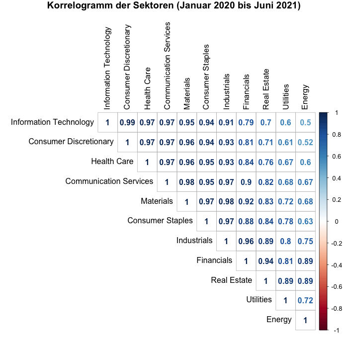
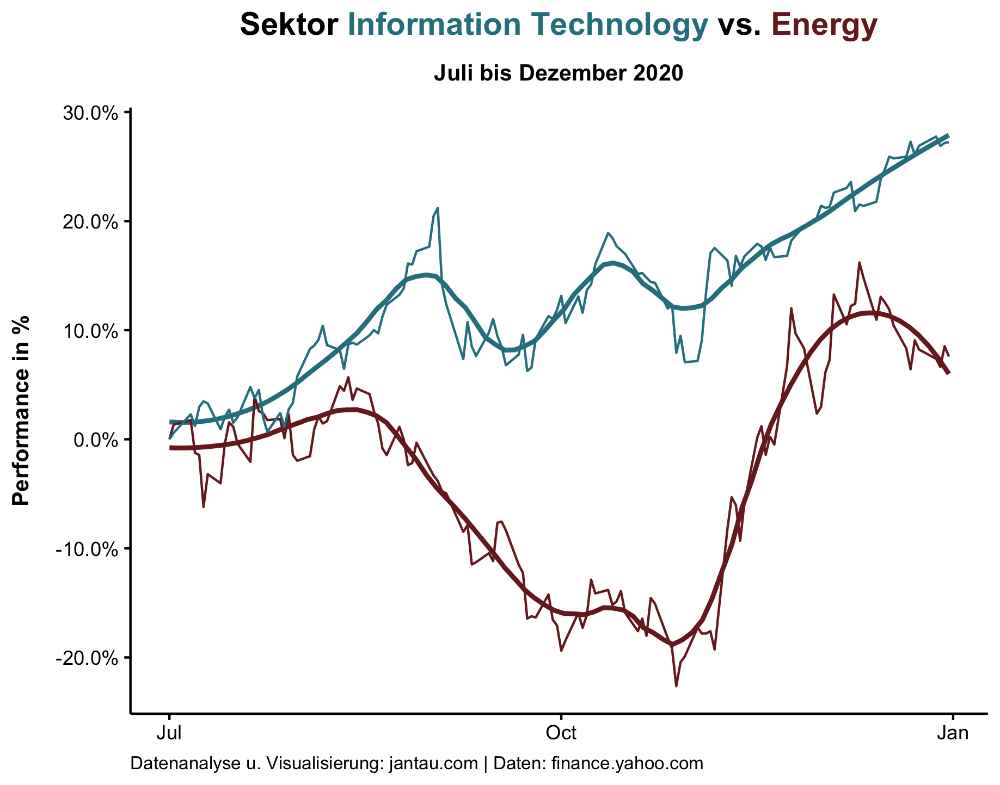
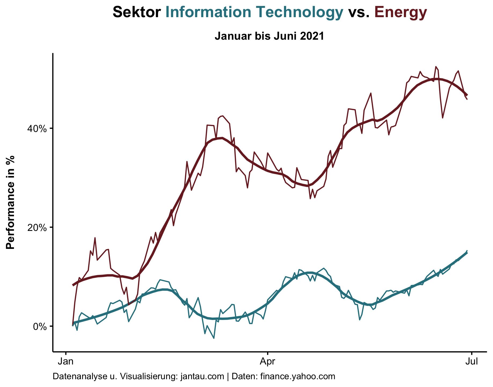
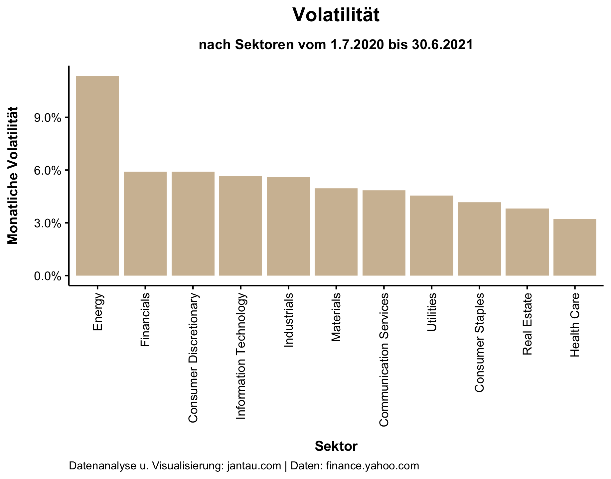

## Sektoren

Über Sektoren hatte ich bereits geschrieben. Mit ihnen werden börsengehandelte Unternehmen klassifiziert. Jedes Unternehmen wird einem von 11 Sektoren — z.B. Information Technology, Health Care oder Energy — zugeordnet. 

Für diesen Blogpost habe ich 11 Sektoren-ETFs von Fidelity analysiert und insbesondere die Sektoren Information Technology und Energy miteinander verglichen.

## Korrelation der Sektoren in einem Korrelationsplot

Die Sektoren entwickeln sich nicht identisch, sie haben jedoch eine mehr oder weniger starke positive Korrelation, wie ein Korrelationsplot der letzten 18 Monate zeigt.

Der Korrelationsplot ist eine Matrix aus verschiedenen in Beziehung zueinander gesetzten  Zeitreihen, deren Werte von 1 bis -1 reichen, wobei 1 eine perfekte positive Korrelation bedeutet und -1 eine perfekte negative Korrelation. Liegt der Wert um 0, dann geht keine Korrelation aus den Werten hervor. Auf die Unternehmens-Sektoren bezogen liegen die Werte zwischen 0,99 und 0,5. Es gibt somit keine Sektoren, die über den untersuchten Zeitraum negativ korrelieren. Die positive Korrelation ist jedoch unterschiedlich stark ausgeprägt. Die Sektoren Information Technology, Consumer Discretionary (Zyklische Konsumgüter), Health Care und Communication Services korrelieren beispielsweise sehr stark (Korrelationskoeffizient 0,99-0,97). Bei den Sektoren Information Technology und Energy ist mit 0,5 nur eine schwache positive Korrelation vorhanden.

## Rotation der Sektoren

Die beiden Sektoren, die am wenigsten korrelieren, möchte ich genauer betrachten, da an ihnen eine Sektorenrotation beschrieben werden kann.

Betrachtet man den Zeitraum Juli 2020 bis Dezember 2020, dann wird deutlich, dass der Sektor Information Technology wesentlich besser gelaufen ist als der Sektor Energy.

Der Sektor Information Technology ist in diesem Zeitraum um fast 27 % gestiegen, während der Anstieg bei Energy "lediglich" 7,5 % betrug und zeitweilig sogar mit 22 % im Minus war. 

Die Kurse der IT-Unternehmen haben sich in diesem Zeitraum hervorragend entwickelt, da ihre Services und Produkte infolge der Corona-Einschränkungen stark nachgefragt waren. Erst im November — nach der US-Wahl und vor allem den positiven Meldungen zu Impfstoffzulassungen — zog der Energiesektor deutlich an und entwickelte sich bis Jahresende sehr stark.

In der ersten Jahreshälfte 2021 setzte sich diese Rotation der Sektoren fort.

Der Energiesektor stieg in diesem Zeitraum um über 45 %, während der IT-Sektor um 15 % zulegte. Im letzten Monat (Juni 2021) deutete sich jedoch eine weitere Rotation an. Energy verlor und Information Technology legte zu. Es ist allerdings schwer einzuschätzen, wie anhaltend dieser Trend ist.

## Sektoren und Volatilität

Die letzten zwei Charts weisen bereits auf eine unterschiedliche Volatilität der Sektoren hin. Im Vergleich zum wilden Hin und Her des Energy-Sektors verzeichnet der traditionell volatile IT-Sektor einen recht kontinuierlichen Kursverlauf.

Das wird auch deutlich, wenn man die monatliche Volatilität des letzten Jahres berechnet. 

Hier zeigt sich, dass Energy der deutliche Ausreißer ist mit einer monatlichen Volatilität von 11 %, während sich die übrigen zehn Sektoren im Spektrum von 3,2 % bis 5,9 % bewegen.

Die außergewöhnlichen Ereignisse der vergangenen Monate lassen plakativ die unterschiedliche Entwicklung der Sektoren aufzeigen. Als langfristig orientierter Retail-Investor werde ich mich jedoch nicht allzu sehr vom Hin und Her der Sektoren beeinflussen lassen, sondern bei meiner Anlagestrategie bleiben.

