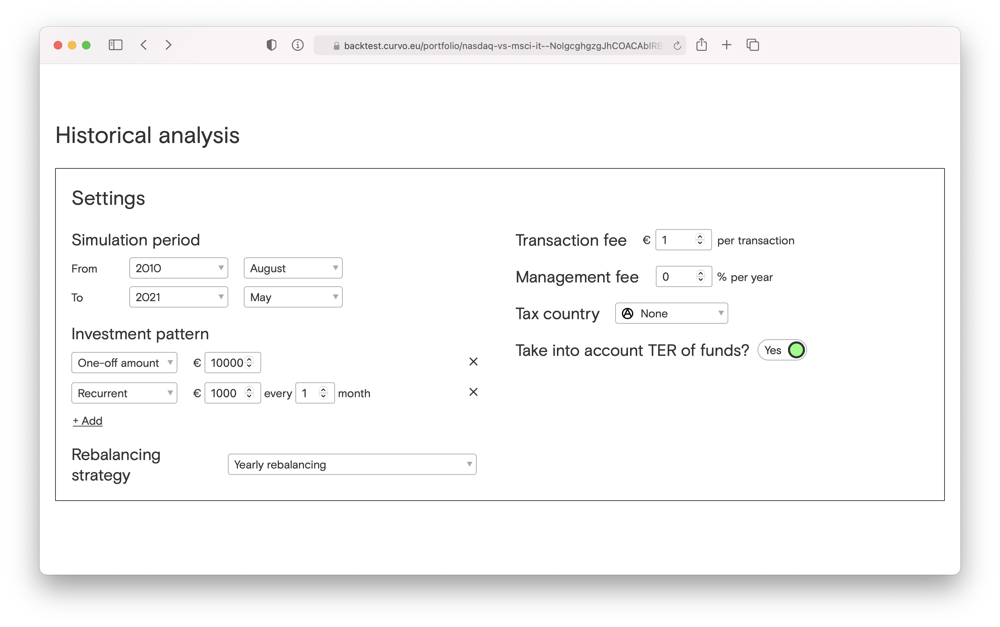
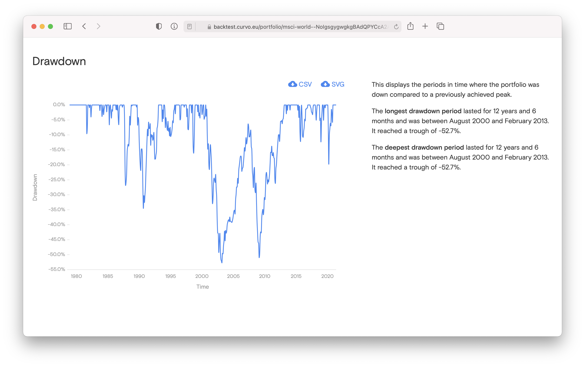

In diesem Blogbeitrag stelle ich zwei Backtesting-Tools vor, auf die ich bei meinen Recherchen gestoßen bin. Backtesting bezeichnet das Verfahren, das ich in diesem Blog hauptsächlich zur Analyse von Aktien und Indizes verwende. Ich schaue mir vergangene Kursverläufe über einen möglichst langen Zeitraum an und versuche Trends zu entdecken oder zu bestätigen, die eine Entscheidung zum Kaufen, Verkaufen, Halten oder Abwarten in der Gegenwart begründen können. Selbstverständlich gilt, dass Entwicklungen der Vergangenheit nur eine begrenzte Aussagekraft über die Zukunft haben: Past performance is no guarantee of future results.

Die Alternativen für Privatanleger zum Backtesting sind einerseits das passive Investieren in ein günstiges Weltportfolio, um der [Markteffizienzhypothese](https://www.finanzfluss.de/etf-handbuch/weltportfolio/#1) folgend durch hohe Diversifizierung das Risiko zu minimieren und von der Rendite der kontinuierlich wachsenden Weltwirtschaft zu profitieren. Beim passiven Investieren wird davon ausgegangen, dass die öffentlich verfügbaren Informationen in den Kurs einer Aktie stets eingepreist sind und dass es daher nicht möglich ist, langfristig den Markt zu schlagen. Dieser Ansatz basiert auch auf Backtests, da so  die Theorie empirisch unterfüttert wird und es zudem verschiedene Ansätze gibt, ein Weltportfolio zu erstellen. Beispielsweise wird [diskutiert](https://www.youtube.com/watch?v=HOUHuKtsE54&t=1177s), ob der Gesamtmarkt anhand der Marktkapitalisierung der einzelnen börsennotierten Unternehmen repräsentiert werden sollte oder ob die Gewichtung der einzelnen Regionen (Nordamerika, Europa, Schwellenländer etc.) im Weltportfolio [nach ihrem Anteil am weltweiten Bruttoinlandsprodukt](https://www.justetf.com/de/academy/globale-aktienstrategien-mit-etfs.html) erfolgen sollte. Diese Fragen können ebenfalls mit Backtests untersucht werden: War in der Vergangenheit ein rein nach Marktkapitalisierung der börsennotierten Unternehmen zusammengestelltes Portfolio erfolgreicher oder eines, das als weiteren Faktor das Bruttoinlandsprodukt der Weltregionen berücksichtigt hat?

Eine weitere zu fundierten Entscheidungen für langfristige Investitionen führende Methode ist, Ineffizienzen des Marktes – sprich unterbewertete Unternehmen – zu identifizieren. Hierfür muss man jedoch entweder über Insiderwissen verfügen (was ich nicht tue) oder die Fähigkeit haben, öffentliche Informationen systematisch nach diesen Ineffizienzen auszuwerten (was ich nicht kann).

Ich kann jedoch skriptbasiert lange Kursreihen analysieren und daraus meine Schlüsse ziehen. Ich bin der Meinung, wenn Anlageprodukt X 30 Jahre kontinuierlich Y geschlagen hat, dann spricht einiges dafür, dass X auch in den nächsten Jahren besser laufen wird als Y.

Die Backtests müssen jedoch regelmäßig aktualisiert werden, um eine mögliche Umkehr des langfristigen Trends zu erkennen. 

Hierfür gibt es auch hervorragende Tools, die für bestimmte Fragestellung die eigenen Analysen ersetzen können.

Ich möchte das Tool [Backtest von Curvo](https://backtest.curvo.eu) vorstellen. Es ist für europäische ETF-Investoren ausgelegt, die tiefere Einblicke in ihre Portfolios gewinnen möchten.

Wie funktioniert es? Ich kann in Europa gehandelte ETFs auswählen und ihren prozentualen Anteil am Portfolio bestimmen. Im nächsten Schritt definiere ich den Simulationszeitraum, das Investitionsmuster (Einmalbetrag, monatlich, jährlich etc.) und die Gebühren (siehe Abbildung). (Die steuerlichen Bedingungen lassen sich zurzeit nur für Belgien auswählen, das Land, aus dem die Entwickler von Backtest kommen.)

Bei der Analyse werden der insgesamt investierte Betrag und der Endbetrag des Portfolios ausgegeben. Zusätzlich werden die jährliche Wachstumsrate (CAGR), die Standardabweichung als das statistische Maß für die Portfolio-Volatilität sowie die Shape Ration als Überschussrendite für die zusätzliche Volatilität eines risikoreichen Assets berechnet. Nach dieser Zusammenfassung werden einige Charts angezeigt, die die jährlichen und monatlichen Renditen und die stärksten Rücksetzer (siehe Abbildung) visualisieren. 

Besonders gut gefällt mir die Funktion, die automatisch die Gewichtung anzeigt, die die beste Rendite oder die geringste Volatilität verzeichnet hätte. Ebenso werden die Auswirkungen vom Rebalancing auf die Rendite und die Korrelation der einzelnen Fonds angezeigt.

Bei meinen Tests habe ich die gängigen in Deutschland verfügbaren ETFs gefunden. Das Tool ist intuitiv bedienbar und die Backtests sind komplex, aber nicht zu technisch, als dass sie für den Privatanleger unüberschaubar würden. 

Wesentlich komplexer und besonders interessant für amerikanische Anleger ist der [Portfolio Visualizer](https://www.portfoliovisualizer.com). Hier kann beispielsweise noch eine Benchmark festgelegt oder eine Entnahmestrategie in den Backtest integriert werden. Es lassen sich zudem Einzelaktien testen, die Analysen können inflationsbereinigt erfolgen und es gibt zahlreiche weitere Funktionen. Leider werden die europäischen ETFs nicht angeboten. Die wichtigen Indizes können aber durch amerikanische Anlageprodukte substituiert werden, was für einen Backtest sicherlich eine ausreichende Annäherung darstellt. Wer möglichst tief in die Analyse einsteigen oder auch Einzelwerte analysieren möchte, für den ist der Portfolio Visualizer ausgezeichnet geeignet. Für den Einstieg in das Backtesting empfehle ich jedoch das komplexitätsreduzierte und aufs Wesentliche fokussierte Backtest-Tool von Curvo.

Den für diesen Beitrag erstellten Code findest du hier: [https://github.com/jantau/jantau](https://github.com/jantau/jantau/tree/main/content/post)

Hat dir der Post gefallen? [Melde dich für meinen Newsletter an](https://tinyletter.com/jantau), um über neue Beiträge informiert zu werden.
