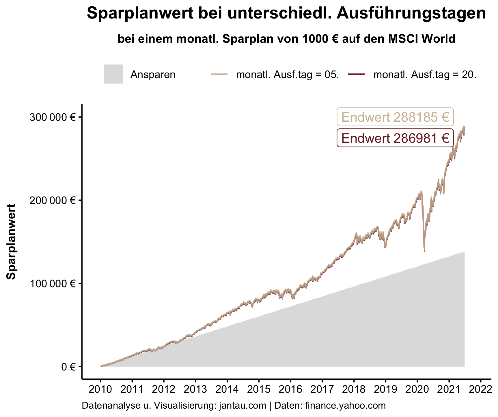
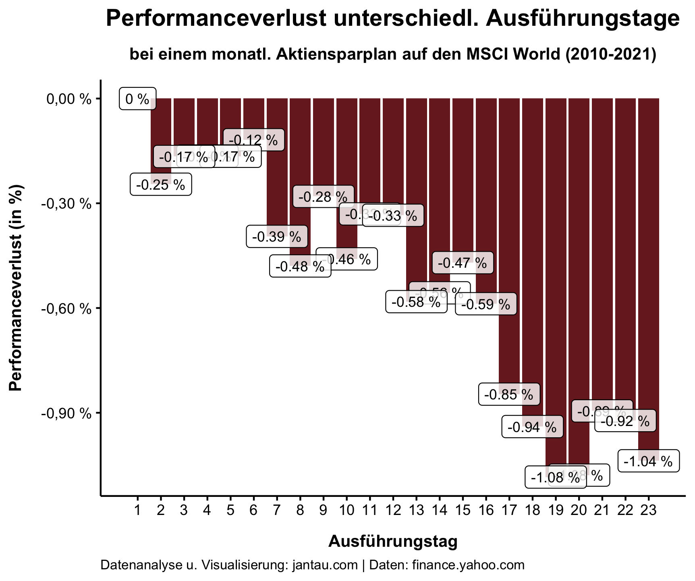
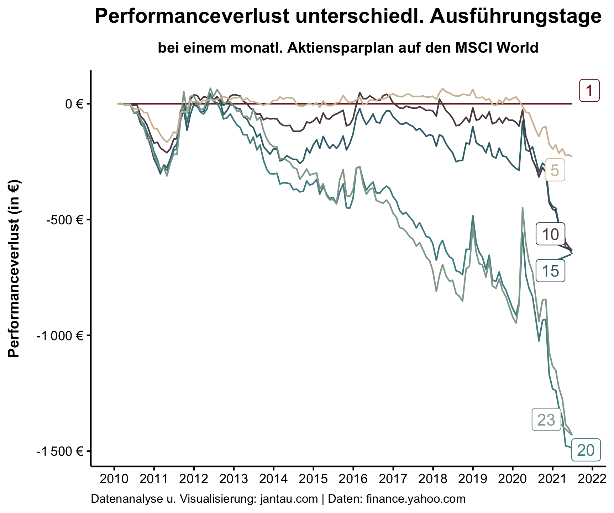

## Monatlich in einen Wertpapiersparplan investieren

Für einen passiven Investor in der Ansparphase ist es am besten, einen Aktiensparplan einzurichten und eine Summe X in regelmäßigen Abständen in einen breit gestreuten ETF zu investieren. Wer monatliche Einnahmen als Gehalt, Rente oder Mieteinnahme hat, sollte auch monatlich Geld zurücklegen und es investieren. Eine Automatisierung dieser Investitionen, also das automatische Überweisen vom Gehaltskonto auf das Depotkonto und von dort auf den Fonds ist zu empfehlen, da so keine Investition verpasst wird und man vor allem nicht der Versuchung unterliegt, Market Timing zu betreiben.

Viele Brokerage-Angebote sind auf diesen Rhythmus ausgerichtet und bieten monatliche Sparpläne an, die automatisch und wiederkehrend den vorgesehenen Betrag (beziehungsweise den auf das Depotkonto überwiesenen Betrag) anlegen.

Allerdings ist es in der Regel nicht möglich, den Ausführungstag – also den Tag im Monat, an dem das gesparte Geld investiert wird – selbst auszuwählen. Die Broker geben diesen Tag vor. (In manchen Fällen sind es auch mehrere Tage, von denen einer ausgewählt werden kann.)

### Ausführungstage der Broker

So wird beim [maxblue Wertpapier Sparplan](https://www.maxblue.de/geldanlage/geld-anlegen/wertpapiersparplan.html) (mein Broker) das gesparte Geld immer am 20. eines Monats (beziehungsweise am nächsten Handelstag, falls der 20. auf ein Wochenende oder einen Feiertag fällt) investiert. Beim [ETF-Sparplan der DKB](https://www.dkb.de/privatkunden/wertpapiersparen/etfs/) (auch mein Broker) kann ausgewählt werden, ob der Sparplan am 5. oder am 20. jedes Monats ausgeführt werden soll. So läuft es auch beim [Broker der Sparkasse](https://www.sbroker.de/handel/sparplaene/aktien-sparplan.html). Bei [Trade Republic](https://support.traderepublic.com/de-de/183-Aktien_Sparpl%C3%A4ne-erkl%C3%A4rt) wird am 2. oder 16. des Monats investiert, während [Scalable Capital zur Frage, wann investiert wird](https://de.scalable.capital/trading-faq), etwas kryptisch schreibt, dass die monatlichen Sparbeiträge zu einem möglichst geeigneten Zeitpunkt nach dem Geldeingang investiert werden. Dies sei in der Regel der zweite Bankarbeitstag des Monats.  

Erst am 20. eines jeden Monats den Sparplan auszuführen, wie es bei maxblue der Fall ist, hat mich etwas misstrauisch gemacht, da ich im Post [Der beste Zeitpunkt zum Investieren](https://www.jantau.com/post/der-beste-zeitpunkt/) gezeigt habe, dass statistisch gesehen stets so früh wie möglich investiert werden sollte. Viele Anleger werden zudem ihr Gehalt oder ähnliche Zahlungen zu Beginn oder zum Ende eines Monats erhalten. Ich bekomme beispielsweise mein Gehalt zum Ende des Monats und überweise einen Teil davon direkt auf mein Depotkonto. Hier liegt es nun für über zwei Wochen, bis es von maxblue in den Sparplan investiert wird.

## Backtest unterschiedlicher Ausführungstage

Ich wollte also untersuchen, ob sich der monatliche Ausführungstag auf die Rendite auswirkt und falls ja, welcher Ausführungstag der beste ist. 

Dafür habe ich einen Backtest durchgeführt und anhand der historischen Kursdaten des [iShares Core MSCI World UCITS ETF USD (Acc)](https://www.justetf.com/en/etf-profile.html?isin=IE00B4L5Y983#overview) einen langjährigen ETF-Sparplan simuliert, in den von 2010 bis 2021 monatlich 1000 Euro investiert wurden. Für den MSCI World von iShares habe ich mich entschieden, da er ein großer, schon länger existierender Fonds ist und weil der MSCI World ein Standardindex ist, der gut für den langfristigen Vermögensaufbau geeignet ist.

Die Simulation habe ich zunächst für den 5. und 20. Tag durchgeführt, da das die Termine sind, die der DKB-Sparplan vorgibt. 

Hier ist das Ergebnis:

Im Linechart, der den Sparplanwert abbildet, ist zunächst kein riesiger Unterschied zu erkennen. Am Ende hat der Sparplan, in den am 5. jedes Monats investiert wurde, einen Wert von 288185 € (ohne Kaufgebühren) und derjenige, in den am 20. jedes Monats investiert wurde, einen Wert von 286981 € (ohne Kaufgebühren). Die Differenz beträgt 1204 €. 

Im nächsten Schritt habe ich die Simulation erweitert und für jeden Ausführungstag vom 1. bis zum 23. des Monats duchgeführt. Diese Ausführungstage habe ich gewählt, um noch einen Tag zu wählen, uf den sicher im entsprechenden Monat ein Bankarbeitstag folgt, so dass das Geld auch wirklich im laufenden Monat investiert wird.

Anschließend habe ich den Performanceverlust in % berechnet und visualisiert. Als Performance habe ich den Teil des Sparplans angenommen, dessen Wert über der Ansparsumme liegt.

Der Barchart zeigt den Performanceverlust über den gesamten Zeitraum für jeden Ausführungstag im Verhältnis zum besten Ausführungstag (der 1. des Monats). Die Tendenz ist eindeutig: Je eher ich in jedem Monat investiere, desto besser. Je später ich im Monat investiere, desto höher ist der Renditeverlust.

Die schlechtesten Tage (der 19. und 20. des Monats) weisen eine um 1,08 % schlechtere Performance auf, als der beste (der 1. des Monats). 

Für die letzte Grafik habe ich noch einmal den gesamten Zeitraum 2010 bis 2021 untersucht.
Der Übersicht halber habe ich nicht alle Ausführungstage visualisiert, sondern nur jeden 5. Ausführungstag.

Auffällig ist, dass in dem Backtest der 1. Ausführungstag nicht kontinuierlich die beste Performance aufweist. Für längere Strecken ist der 5. Ausführungstag profitabler und selbst der 10. Ausführungstag kann über einen langen Zeitraum gut mithalten. Insbesondere der starke Bullenmarkt seit dem Corona-Blitzcrash im März 2020 lässt den 1. Ausführungstag glänzen.

## Ergebnis: um den 5. des Monats investieren 

Ich habe keine Erklärung dafür, nach welchen Kriterien die Broker die Ausführungstage auswählen. Gut nachvollziehbar ist für mich ein Ausführungstag um den 5. des Monats, wie es auch von vielen Brokern gehandhabt wird. Zu diesem Zeitpunkt sollte der monatliche Geldeingang bei den meisten erfolgt sein und der Perfomanceverlust ist noch gering.

Der letzte Chart zeigt zudem, dass über einen längeren Zeitraum der 5. des Monats als Ausführungstag sogar der bessere Anlagetag war als der 1. des Monats.

Der Performanceverlust ist für mich sicherlich alleine noch kein Grund, den Broker zu wechseln. Beim Abschluss eines neuen ETF-Sparplans würde ich jedoch darauf achten, dass der  Ausführungstag möglichst früh im Monat ist.

Den für diesen Beitrag erstellten Code findest du hier: [https://github.com/jantau/jantau](https://github.com/jantau/jantau/tree/main/content/post)

Hat dir der Post gefallen? [Melde dich für meinen Newsletter an](https://tinyletter.com/jantau), um über neue Beiträge informiert zu werden.