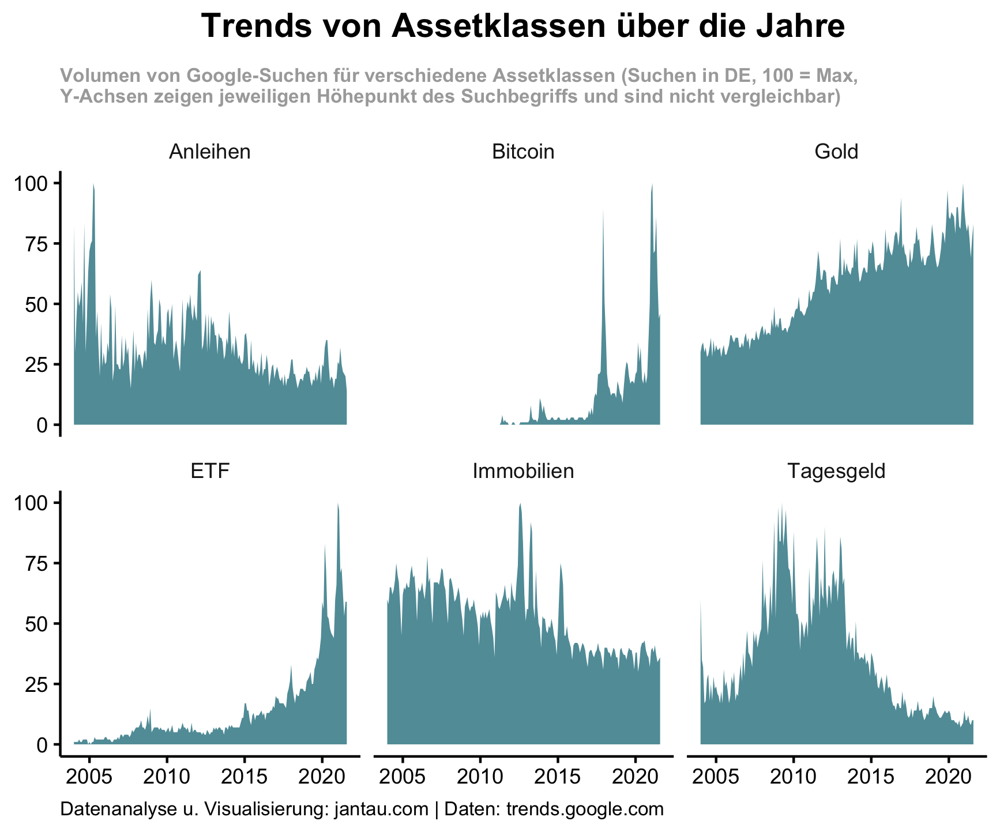
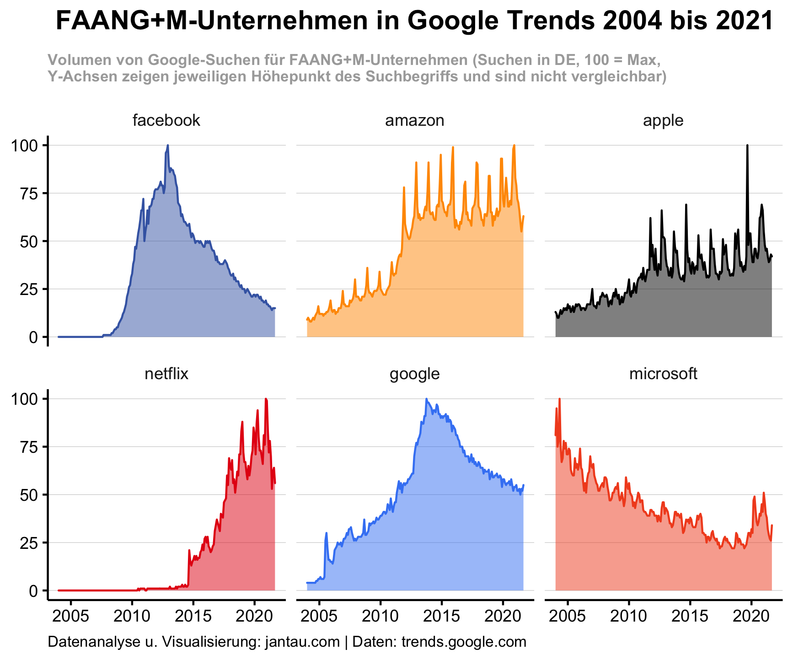
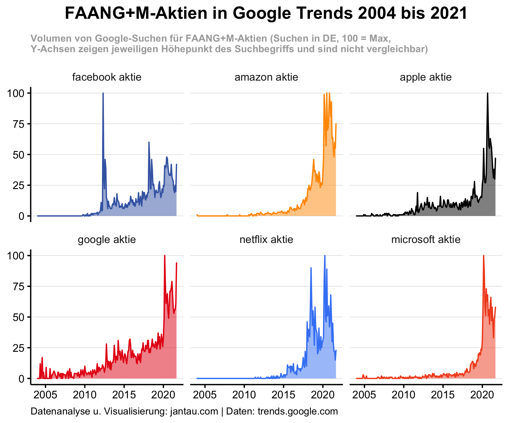

## Google Trends

Weltweit werden täglich etwa [5,6 Milliarden Google-Suchen](https://blog.hubspot.com/marketing/google-search-statistics) durchgeführt. Die Summe dieser Aktionen zeigt, was die Menschen bewegt und interessiert. Mit Google Trends stellt Google eine Schnittstelle zur Verfügung, über die jeder nachverfolgen kann, wie sich das relative Suchvolumen bestimmter Begriffe entwickelt hat (siehe auch die [FAQ über Google Trends-Daten](https://support.google.com/trends/answer/4365533?hl=en)). Die Daten von Google Trends basieren auf einer repräsentativen Stichprobe und können länderspezifisch abgefragt werden. Ich habe die Daten von Google genutzt, um nachzuspüren, wie sich das Interesse an Suchbegriffen rund um das Thema persönliche Finanzen in den vergangenen Jahren entwickelt hat.

### Anlageklassen und Google Trends

In meiner ersten Analyse habe ich untersucht, wie sich das Suchvolumen nach verschiedenen Anlageklassen entwickelt hat.

[Eine Anlageklasse oder Asset Class ist eine Gruppierung von Anlageprodukten](https://www.investopedia.com/terms/a/assetclasses.asp), die ähnliche Merkmale aufweisen und denselben Gesetzen und Vorschriften unterliegen. Anlageklassen sind etwa Aktien, Anleihen, Rohstoffe, Immobilien, Geldmarktinstrumente (bspw. Tagesgeldkonten) oder auch Sammlerstücke. (Idealerweise ist die Korrelation zwischen verschiedenen Anlageklassen nicht besonders hoch oder sogar negativ, so dass die Investition in verschiedene Anlageklassen der Diversifikation des Portfolios dienen kann.)

Ich habe sechs Anlageklassen ausgewählt und für den Zeitraum Januar 2004 (der früheste Zeitpunkt, für den Google Daten zur Verfügung stellt) bis August 2021 untersucht. Hierbei habe ich mich auf Google-Suchen in Deutschland beschränkt. Ich habe auch nicht immer den generischen Anlageklasse-Namen als Suchbegriff gewählt, sondern teilweise konkrete Finanzprodukte ausgewählt, da ich davon ausgehe, dass diese exemplarisch für das Interesse an einer Anlageklasse stehen und das Suchverhalten der Google-Nutzer besser abbilden. Meine Annahme ist: Wenn ich in den Aktienmarkt investieren möchte, dann suche ich nicht mit dem Begriff "Aktien", sondern entweder nach einer konkreten Aktie (etwa "SAP-Aktie") oder auch nach "ETF". Ebenso google ich nicht nach "Geldmarktinstrument", wenn ich mein Geld möglichst risikoarm investieren möchte, sondern nach "Tagesgeld" oder "Festgeld".

Hier ist das Ergebnis der Google-Trends-Analyse der sechs Anlageklassen Anleihen, Bitcoin, Gold, ETF, Immobilienfonds und Tagesgeld.

Wir sehen drei Anlageklassen mit einer steigenden Tendenz (Bitcoin, Gold und ETF) über den Untersuchungszeitraum und drei Anlageklassen mit sinkender Tendenz (Anleihen, Immobilienfonds, Tagesgeld).

Anleihen haben ab 2006 deutlich an Interesse verloren. Seit 2016 ist das Interesse an ihnen auf einem niedrigen Niveau ziemlich stabil. 

Das Ergebnis für den Suchbegriff "Bitcoin" hat mich wenig überrascht. Das erste Interesse ist im Mai 2011 messbar. Die zwei Boomzeiten 2017/2018 und 2020/2021 bilden die Höhepunkte der Suchen nach Bitcoin.

Bei Gold hat mich gewundert, dass das Interesse so kontinuierlich zunimmt. Von 2004 bis 2021 hat sich das relative Interesse fast verdreifacht (von 30 auf 83), was ich so nicht erwartet hätte. Allerdings ist in diesem Zeitraum auch der Goldrpeis ziemlich kontinuierlich gestiegen und hat sich letztendlich vervierfacht.

Einen Anstieg am Interesse an ETFs hatte ich erwartet. Dass dieser Anstieg coronabedingt in den letzten beiden Jahren so gewaltig ist, hat mich dann doch überrascht.

Von einem sinkenden Interesse an Immobilien bin ich nicht ausgegangen. Ich hatte erwartet, dass die steigenden Immobilienpreise der letzten zehn Jahre auch einen Anstieg der Suche nach Immobilien nach sich gezogen hätten. 

Dass Tagesgeld keine attraktive Anlageklasse ist, ist klar. Die Google-Trend-Daten zeigen noch einmal wie stark das Interesse nachgelassen hat. Das größte relative Interesse bestand im April 2009. Bis August 2021 ist es jedoch um 90 % eingebrochen.

Wie stark die Google-Trend-Daten mit der Wertentwicklung der entsprechenden Finanzprodukte korrelieren, habe ich einmal anhand des Goldpreises analysiert. Dafür habe ich die [Compound Annual Growth Rate CAGR](https://www.investopedia.com/terms/c/cagr.asp) oder die jährliche Wachstumsrate sowohl für das relative Interesse am Suchbegriff "Gold" als auch für den Goldpreis ausgerechnet. Die Korrelation ist deutlich. Die CAGR für die Google-Suchen beträgt für den Zeitraum 2004 bis August 2021 5,9 % (von 30 auf 83), für den Goldpreis 9,14 % (von 330 € auf 1535 €).

Dass eine solche Korrelation nicht immer der Fall ist, zeigt jedoch das Beispiel Immobilien, wo steigende Preise nicht mit einem gestiegenen Interesse einhergingen.

### Interesse an FAANG+M

In einem nächsten Schritt habe ich mir das Google-Interesse an den FAANG+M-Unternehmen angeschaut. FAANG+M ist ein Akronym, das für die beliebten und in den vergangenen Jahren extrem stark gestiegenen Aktien der Tech-Unternehmen Facebook, Amazon, Apple, Netflix, Google (Alphabet) und Microsoft steht.

Interessant finde ich zunächst die deutlichen Spikes in den Suchhäufigkeiten von Amazon, Apple und Netflix. Sie verweisen auf ein saisonales Interesse an den Unternehmen. Die Google-Suchen nach Apple sind regelmäßig im September am höchsten, wenn das Unternehmen das neue iPhone und andere Produkte vorstellt. Bei Amazon ist es das Weihnachtsgeschäft im November und Dezember und auch bei Netflix ist das Interesse am Jahresende am größten, wenn die Tage kurz sind und die Leute viel Zeit zum Fernsehen haben.

Im Gegenzug weisen Google und Facebook kein deutliches saisonales Interesse auf, was sicherlich mit ihrem werbebasierten Geschäftsmodell zu erklären ist, das kein gesteigertes Interesse zu Weihnachten oder um neue Produkte generiert.

Der Chart zeigt, dass Google-Suchen nach Facebook, Google und Microsoft eine sinkende Tendenz aufweisen, wohingegen Amazon, Apple und Netflix ein steigendes Interesse verzeichnen. Das sinkende Suchvolumen nach Facebook, Google oder Microsoft bedeutet jedoch nicht, dass die Unternehmen für Investoren unattraktiv geworden sind. Ein Blick auf die Suchen nach den Aktien der Unternehmen (Suche mit "Facebook Aktie", "Amazon Aktie" usw.) zeigt nämlich ein anderes Bild. 

Die Suchen nach den FAANG+M-Aktien haben alle einen ähnlichen Verlauf. Bis auf Facebook, das das größte Interesse zum Börsengang verzeichnete, haben alle ihren Höhepunkt im Corona-Blitz-Crash 2020, was sich auch weitestgehend mit der Entwicklung ihrer Börsenkurse deckt.

### Ergebnis

Die explorative Analyse von Suchen rund um das Thema persönliche Finanzen in Google Trends bestätigt viele meiner Annahmen und kann helfen, diese zu quantifizieren. Die teilweise überraschenden Erkenntnisse zeigen, worauf es sich in weiteren Analysen lohnen kann, einen tiefer gehenden Blick zu werfen.

Den für diesen Beitrag erstellten Code findest du hier: [https://github.com/jantau/jantau](https://github.com/jantau/jantau/tree/main/content/post)

Hat dir der Post gefallen? [Melde dich für meinen Newsletter an](https://tinyletter.com/jantau), um über neue Beiträge informiert zu werden.