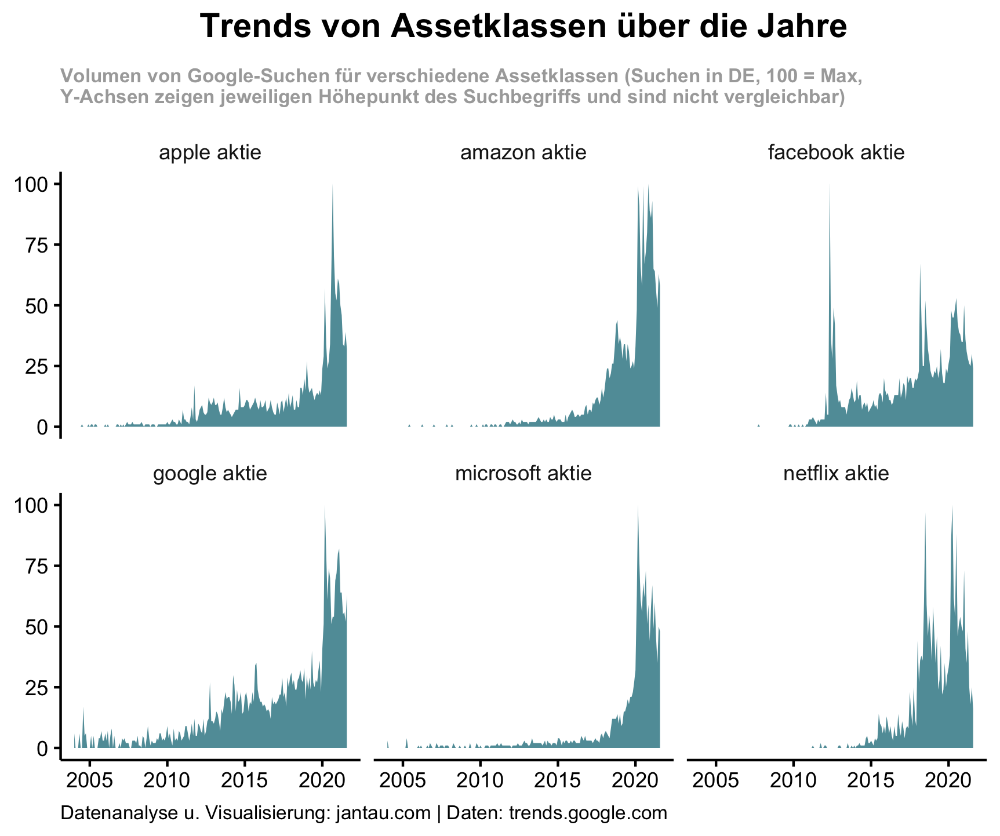

## Google Trends

Ich habe mir Daten von Google Trends genauer angeschaut, um die Beliebtheit von Anlageklassen über die vergangenen Jahre zu analysieren. 

### Was ist Google Trends?

(siehe auch die [FAQ über Google Trends-Daten](https://support.google.com/trends/answer/4365533?hl=en)).

### Was sind Anlageklassen?

[Eine Anlageklasse oder Asset Class ist eine Gruppierung von Anlageprodukten](https://www.investopedia.com/terms/a/assetclasses.asp), die ähnliche Merkmale aufweisen und denselben Gesetzen und Vorschriften unterliegen. Allgemeine Beispiele für Anglageklassen sind etwa Aktien, Anleihen, Rohstoffe, Immobilien, Geldmarktinstrumente (bspw. Tagesgeldkonten), Sammlerstücke. Idealerweise ist die Korrelation zwischen verschiedenen Anlageklassen nicht besonders hoch oder sogar negativ, so dass die Investition in verschiedene Anlageklassen der Diversifikation des Portfolios dienen kann.

Ich habe Anlageklassen ausgewählt und für den Zeitraum Januar 2004 bis August 2021 untersucht. Hierbei habe ich mich auf Suchen in Deutschland beschränkt. Ich habe auch nicht immer den generischen Anlageklassennamen als Suchbegriff gewählt, sondern konkretere Produkte ausgewählt, da ich davon ausgehe, dass diese Produkte exemplarisch für das Interesse an einer Anlageklasse stehen und darüber hianus das Suchverhalten der Google-Nutzer besser abbildet. Meine Annahme ist: Wenn ich in den Aktienmarkt investieren möchte, dann Suche ich nicht mit dem Begriff "Aktien", sondern entweder nach einer konkreten Aktie (wie etwas "SAP Aktie") oder auch nach "ETF". Ebenso google ich nicht nach "Geldmarktinstrument", wenn ich mein Geld möglichst risikoarm investieren möchte, sondern nach "Tagesgeld" oder "Festgeld".

Hier ist das Ergebnis der Google Trends-Analyse der sechs Anlageklassen Anleihen, Bitcoin, Gold, ETF, Immobilienfonds und Tagesgeld.

### Assetklassen

Wir sehen drei Anlageklassen mit einer steigenden Tendenz (Bitcoin, Gold und ETF) und drei Anlageklassen mit sinkender Tendenz (Anleihen, Immobilienfonds, Tagesgeld).

Anleihen sind ab 2006 deutlich gesunken und seit 2016 ziemlich stabil. 

Bitcoin hat mich vielleicht am wenigsten überraschst. Zwei Boomzeiten 2017/2018 unnd 2020/2021.

Bei Gold hat mich zunächst überrascht, dass das Interesse so kontinuierlich zunimmt. Von 2004 bis 2021 hat sich das relative Interesse verdreifacht, was ich erheblich finde und so nicht erwartet hätte. Allerdings hat sich in diesem Zeitraum auch ziemlich kontinuierlich der Goldpreis vervierfacht.

Für Gold habe ich den CAGR oder die jährliche Wachstumsrate sowohl für das relative Googleinteresse als auch für den Goldpreis einmal ausgerechnet. Die Korrelation ist deutlich. Das CAGR für die Google-Suchen beträgt für den Zeitraum 2004 bis August 2021 5,9 % (von 30 auf 83), für den Goldpreis 9,14 % (von 330 € auf 1535 €).

Einen Anstieg am Interesse an ETFs hatte ich erwartet, dass der Anstieg in den letzten beiden Jahren so gewaltig ist, hatte ich dann nicht gedacht.

Das sinkende Interesse an Immobilien hätte ich nicht erwartet, da ich davon ausgegangen bis, dass steigende Immobilienpreise nach verstärkter Suche nach Immobilien bei Google nachsichziehen würde.

Das Tagesgeld keine attraktive Anlageklasse ist, ist klar. Die Google Trend-Daten zeigen noch einmal wie stark das Interesse nachgelassen hat. Das größte relative Interesse bestand im April 2009. Bis August 2021 ist das Interesse um 90 % eingebrochen.

### FANG-Aktien

### Deutschlandkarte

#### Passives Einkommen
ETF

#### Risikoreiche alternative Anlageklasse
Bitcoin

#### Klassische Anlageklasse
Tagesgeld

Den für diesen Beitrag erstellten Code findest du hier: [https://github.com/jantau/jantau](https://github.com/jantau/jantau/tree/main/content/post)

Hat dir der Post gefallen? [Melde dich für meinen Newsletter an](https://tinyletter.com/jantau), um über neue Beiträge informiert zu werden.