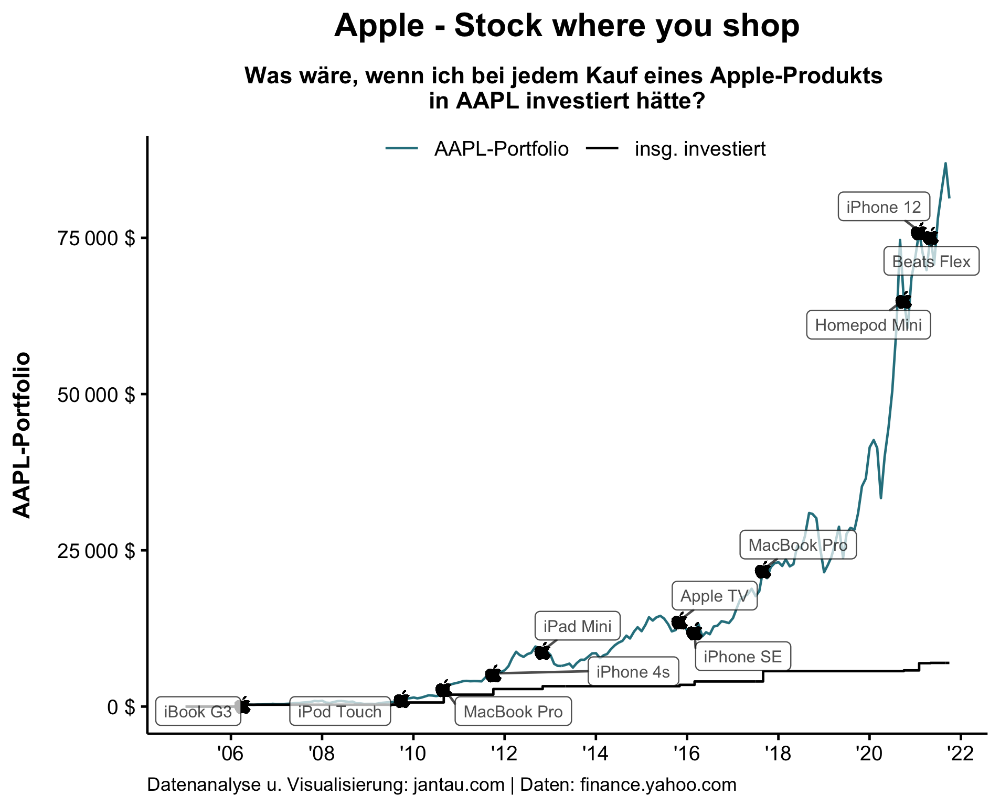

Mir gefällt das Konzept von "stock where you shop", also Aktien von denjenigen Unternehmen zu kaufen, deren Produkte man selbst nutzt.

Analysen zeigen, dass auf Grundlage des eigenen Konsums Investitionsentscheidungen zu treffen durchaus erfolgsversprechend ist. 

Der [Becky-ETF](https://beckyetf.com/), der stereotyp das Konsumverhalten von Frauen berücksichtigt und Aktien von Apple, Lululemon, Netflix, Peloton, Starbucks, Spotify oder Etsy enthält, oder auch der Chad-Index, der ebenso stereotyp männlichen Konsum abbildet mit Aktien von Nike, Ralph Lauren, Under Armor oder Anheuser-Busch, zeigen eine deutlich überdurchschnittliche Performance. Überteuerte Lifestyle-Marken schneiden demnach dank ihrer großen Bekanntheit überdurchschnittlich gut ab.

Es gibt auch Apps wie [grifin](https://www.grifin.com), die bei jedem Kauf eines der oben aufgelisteten Produkte einen bestimmten Wert (etwa 1 USD) in das entsprechende Unternehmen investieren.

Die Performance eines solchen Verhaltens möchte ich einmal rückblickend mit meinem Erwerb von Apple-Produkten überprüfen. Seit 2006 nutze ich iPhones, MacBooks oder iPads. Ich möchte simulieren, wie sich ein hypothetisches Apple-Portfolio entwickelt hätte, wenn ich bei jedem Kauf eines Apple-Produkts den Kaufpreis noch einmal in Apple-Aktien (AAPL) investiert hätte. 

Das Ergebnis ist wirklich bemerkenswert.

Im Jahr 2006 habe ich für 250 Euro (etwa 300 Dollar zum damaligen Kurs) ein gebrauchtes (und ziemlich unbrauchbares) iBook G3 gekauft. Für 300 Dollar hätte ich 156 Apple-Aktien zu 1,92 Dollar bekommen. (Der Preis ist adjusted, was bedeutet, dass die Dividenden mathematisch reinvestiert und die Aktiensplits seit 2006 berücksichtigt wurden.) Vier Jahre später musste ich bereits den Gegenwert meines MacBooks (oder 1250 Dollar) investieren, um 162 Apple-Aktien zu erhalten. Etwas über zehn weitere Jahre später, im Jahr 2021, gab es für einen ähnlichen Preis, den Wert eines iPhones 12 (1150 Dollar), lediglich 8,6 Apple-Aktien (siehe auch Tabelle).

Insgesamt hätte ich im Zeitraum 2006 bis 2021 6990 Dollar investiert. Diese Investition wäre Anfang Oktober 2021 beachtliche 81300 Dollar wert gewesen.

Selbstverständlich ist diese Simulation nur ein Beispiel. Aber es zeigt, dass es sich auszahlen kann, in die Unternehmen zu investieren, von deren Produkten man überzeugt ist und die man kontinuierlich über einen längeren Zeitraum kauft. Immerhin hat man als Retail-Investor über diese Unternehmen mehr Wissen als über viele andere, die keine Produkte oder Services für Endkunden anbieten. Ein weiterer Vorteil ist, dass du gewissermaßen dein eigener Kanarienvogel im Bergwerk sein kannst. Es ist schwer, Unternehmen zu bewerten. Große Finanzinstitute mit bestbezahlten Analysten versuchen sich in dieser Aufgabe und liegen oft genug daneben. Wenn du jedoch selbst nicht mehr von den Produkten überzeugt bist und die Konkurrenz besser ist, dann kann dies ein Indikator sein, dass es mit dem Unternehmen bergab geht und du deine Aktienposition verkaufen oder reduzieren solltest.

### Datentabelle

| Datum      | Apple-Produkt | Preis in € | Preis in $ | Preis AAPL-Akt. in $ (adjusted) | Anzahl AAPL-Akt. | insg. Anzahl AAPL-Akt. | Wert AAPL-Portf. in $ | insg. invest. in $ |
|------------|---------------|------------|------------|---------------------------------|------------------|------------------------|-----------------------|--------------------|
| 2006-04-01 | iBook G3      | 250        | 300        | 1,9                             | 156,2            | 156,2                  | 300                   | 300                |
| 2009-10-01 | iPod Touch    | 250        | 360        | 5,5                             | 64,9             | 221,1                  | 1226,05               | 660                |
| 2010-09-01 | MacBook Pro   | 1000       | 1250       | 7,7                             | 162,8            | 383,9                  | 2946,99               | 1910               |
| 2011-10-01 | iPhone 4s     | 650        | 900        | 11,5                            | 78,3             | 462,3                  | 5309,94               | 2810               |
| 2012-11-01 | iPad Mini     | 350        | 450        | 18,4                            | 24,5             | 486,7                  | 8942,24               | 3260               |
| 2015-11-01 | Apple TV      | 200        | 220        | 27,8                            | 7,9              | 494,7                  | 13759,95              | 3480               |
| 2016-03-01 | iPhone SE     | 500        | 540        | 23,3                            | 23,2             | 517,8                  | 12066,22              | 4020               |
| 2017-09-01 | MacBook Pro   | 1400       | 1650       | 39,1                            | 42,2             | 560                    | 21918,81              | 5670               |
| 2020-10-01 | Homepod Mini  | 100        | 120        | 116                             | 1                | 561                    | 65102,91              | 5790               |
| 2021-02-01 | iPhone 12     | 950        | 1150       | 133,5                           | 8,6              | 569,6                  | 76053,42              | 6940               |
| 2021-05-01 | Beats Flex    | 40         | 50         | 132,1                           | 0,4              | 570                    | 75308,55              | 6990               |